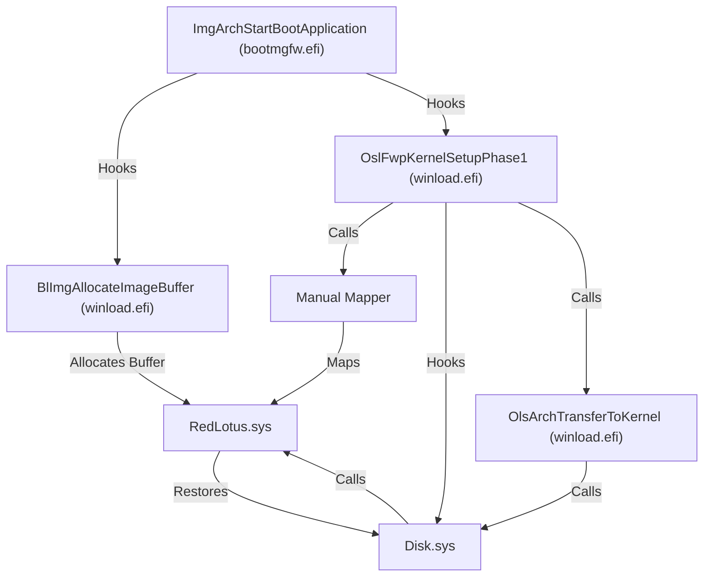
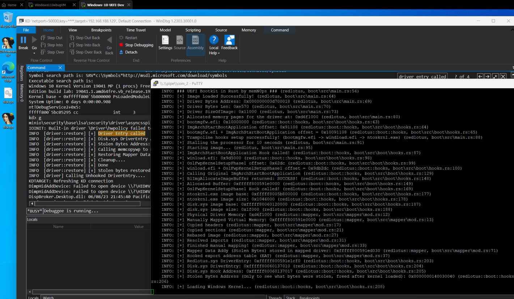

# Windows UEFI Bootkit in Rust (Codename: RedLotus)

Windows UEFI bootkit in Rust for manually mapping a [Windows kernel rootkit](https://github.com/memN0ps/rootkit-rs) or [Windows blue-pill hypervisor](https://github.com/memN0ps/hypervisor-rs) using a UEFI runtime driver (`EFI_RUNTIME_DRIVER`) similar to [umap by @btbd](https://github.com/btbd/umap/).

A bootkit can run code before the operating system and potentially inject malicious code into the kernel or load a malicious kernel driver by infecting the boot process and taking over the system's firmware or bootloader, effectively disabling or bypassing security protections. While it's possible to use this for advanced adversary simulation or emulation (red teaming), it's unlikely to be used in most engagements. This tool can also be used for game hacking and is a side project for those interested in fun, learning, malware research, and spreading security awareness. It also demonstrates that Rust can handle both low-level and high-level tasks. One important capability of this tool is its ability to load a kernel driver before the operating system or even execute shellcode in the kernel to bypass Windows security protections. It's important to recognize the potential of Rust and not underestimate its power.

This project is inspired by the following:

- umap: https://github.com/btbd/umap/ (This project has been ported from C to Rust)
- Bootlicker: https://github.com/realoriginal/bootlicker
- BlackLotus: https://www.welivesecurity.com/2023/03/01/blacklotus-uefi-bootkit-myth-confirmed/
- ESPecter: https://www.welivesecurity.com/2021/10/05/uefi-threats-moving-esp-introducing-especter-bootkit/
- UEFI-Bootkit: https://github.com/ajkhoury/UEFI-Bootkit/
- EfiGuard: https://github.com/Mattiwatti/EfiGuard
- Bootkitting Windows Sandbox: https://secret.club/2022/08/29/bootkitting-windows-sandbox.html

## TODO

- Refactor code
- Better error handling
- Provide stability
- Make a blog or diagram on how it works

The image below shows how Legacy and UEFI boot works.


**Figure 1. Comparison of the Legacy Boot flow (left) and UEFI boot flow (right) on Windows (Vista and newer) systems (Full Credits: [WeLiveSecurity](https://www.welivesecurity.com/2021/10/05/uefi-threats-moving-esp-introducing-especter-bootkit/))**

This diagram illustrates the structure and flow of the RedLotus.efi UEFI bootkit (RedLotus.sys is the Windows kernel driver)




## Install

### [Install Rust](https://www.rust-lang.org/tools/install)

To start using Rust, [download the installer](https://www.rust-lang.org/tools/install), then run the program and follow the onscreen instructions. You may need to install the [Visual Studio C++ Build tools](https://visualstudio.microsoft.com/visual-cpp-build-tools/) when prompted to do so.


### [Install and change to Rust nightly](https://rust-lang.github.io/rustup/concepts/channels.html)

```
rustup toolchain install nightly
rustup default nightly
```

### [Install cargo-make](https://github.com/sagiegurari/cargo-make)

```
cargo install cargo-make
```

### [Install WDK/SDK](https://docs.microsoft.com/en-us/windows-hardware/drivers/download-the-wdk)

* Step 1: Install Visual Studio 2022
* Step 2: Install Windows 11, version 22H2 SDK
* Step 3: Install Windows 11, version 22H2 WDK

## Build

Change directory to `.\driver\` and build driver

```
cargo make sign
```

Change directory to `.\bootkit\` and build bootkit

```
cargo build --target x86_64-unknown-uefi --release
```

## Usage

A UEFI Bootkit works under one or more of the following conditions:

- Secure Boot is disabled on the machine, so no vulnerabilities are required to exploit it (**supported by this project**).

- Exploiting a known flaw in the UEFI firmware to disable Secure Boot in the case of an out-of-date firmware version or a product no longer supported, including the Bring Your Own Vulnerable Binary (BYOVB) technique to bring copies of vulnerable binaries to the machines to exploit a vulnerability or vulnerabilities and bypass Secure Boot on up-to-date UEFI systems (1-day/one-day).

- Exploiting an unspecified flaw in the UEFI firmware to disable Secure Boot (0-day/zero-day vulnerability).

### Usage 1: Infect Windows Boot Manager `bootmgfw.efi` on Disk (Unsupported)

Typically UEFI Bootkits infect the Windows Boot Manager `bootmgfw.efi` located in EFI partition `\EFI\Microsoft\Boot\bootmgfw.efi` (`C:\Windows\Boot\EFI\bootmgfw.efi`. Modification of the bootloader includes adding a new section called `.efi` to the Windows Boot Manager `bootmgfw.efi`, and changing the executable's entry point address so program flow jumps to the beginning of the added section as shown below:

- Convert bootkit to position-independent code (PIC) or shellcode
- Find `bootmgfw.efi` (Windows Boot Manager) located in EFI partition `\EFI\Microsoft\Boot\bootmgfw.efi`
- Add `.efi` section to `bootmgfw.efi` (Windows Boot Manager)
- Inject or copy bootkit shellcode to the `.efi` section in `bootmgfw.efi` (Windows Boot Manager)
- Change entry point of the `bootmgfw.efi` (Windows Boot Manager) to newly added `.efi` section bootkit shellcode
- Reboot

### Usage 2: Execute UEFI Bootkit via UEFI Shell (Supported)

Download [EDK2 efi shell](https://github.com/tianocore/edk2/releases) or [UEFI-Shell](https://github.com/pbatard/UEFI-Shell/releases) and follow these steps:

1. Extract downloaded efi shell and rename file `Shell.efi` (should be in folder `UefiShell/X64`) to `bootx64.efi`

2. Format USB drive to FAT32

3. Create following folder structure:

```
USB:.
 │   redlotus.efi
 │
 └───EFI
      └───Boot
              bootx64.efi
```

4. Boot from the USB drive

    4.1. The following is required for VMware Workstation:

    * VMware Workstation: `VM -> Settings -> Hardware -> Add -> Hard Disk -> Next -> SCSI or NVMe (Recommended) -> Next -> Use a physical disk (for advanced users) -> Next -> Device: PhysicalDrive1 and Usage: Use entire disk -> Next -> Finish.` 

    * Start VM by clicking `Power On to Firmware`

    * Select Internal Shell (Unsupported option) or EFI Vmware Virtual SCSI Hard Drive (1.0)

5. A UEFI shell should start, change directory to the same location as the Windows Boot Manager (e.g. `FS0`). **Note that the file system could be different for your machine**

```
FS0:
```

6. Copy the bootkit to the same location as the Windows Boot Manager (e.g. `FS0`).

```
cp fs2:redlotus.efi fs0:
```

7. Load the the bootkit

```
load redlotus.efi
```

8. Windows should boot automatically.

## PoC



## Credits / References / Thanks / Motivation

* BTBD: https://github.com/btbd/umap/

* Austin Hudson: https://github.com/realoriginal/bootlicker

* Thanks for all the help: inlineHookz (smoke/snow/never_unsealed): https://twitter.com/never_unsealed

* Rust Community Discord: https://discord.com/invite/rust-lang (#windows-dev channel PeterRabbit, MaulingMonkey etc..)

* Aidan Khoury: https://github.com/ajkhoury/UEFI-Bootkit/

* Matthijs Lavrijsen: https://github.com/Mattiwatti/EfiGuard

* Welivesecurity: https://www.welivesecurity.com/2021/10/05/uefi-threats-moving-esp-introducing-especter-bootkit/

* Welivesecurity: https://www.welivesecurity.com/2023/03/01/blacklotus-uefi-bootkit-myth-confirmed/

* MrExodia: https://secret.club/2022/08/29/bootkitting-windows-sandbox.html

* Samuel Tulach: https://github.com/SamuelTulach/rainbow

* UnknownCheats: https://www.unknowncheats.me/forum/anti-cheat-bypass/452202-rainbow-efi-bootkit-hwid-spoofer-smbios-disk-nic.html

* ekknod: https://github.com/ekknod/sumap/

* Cr4sh: https://github.com/Cr4sh/s6_pcie_microblaze/tree/master/python/payloads/DmaBackdoorBoot

* Alex Matrosov: Rootkits and Bootkits: https://nostarch.com/rootkits by [Alex Matrosov](https://twitter.com/matrosov)

* Binarly: https://www.binarly.io/posts/The_Untold_Story_of_the_BlackLotus_UEFI_Bootkit/index.html

* rust-osdev: https://github.com/rust-osdev/uefi-rs

* rust-osdev: https://github.com/rust-osdev/bootloader

* rust-osdev: https://crates.io/crates/uefi

* rust-osdev: https://docs.rs/uefi/latest/

* rust-osdev: https://rust-osdev.github.io/uefi-rs/HEAD/

* https://learn.microsoft.com/en-us/windows-hardware/manufacture/desktop/bcd-system-store-settings-for-uefi?view=windows-11

* https://developer.microsoft.com/en-us/windows/downloads/virtual-machines/

* https://github.com/LongSoft/UEFITool

* https://github.com/tianocore/edk2

* https://github.com/pbatard/UEFI-Shell

* https://securelist.com/cosmicstrand-uefi-firmware-rootkit/106973/

* https://wikileaks.org/ciav7p1/cms/page_36896783.html

* https://github.com/nix-community/lanzaboote/

* https://github.com/lyricalsoul/genie/

* https://github.com/pfnsec/uefi-bin-enum/

* https://github.com/coreos/picker

* https://github.com/mikroskeem/apple-set-os/

* https://github.com/Justfr33z/trampoline/

* https://github.com/kweatherman/sigmakerex

* https://guidedhacking.com/threads/external-internal-pattern-scanning-guide.14112/

* https://guidedhacking.com/resources/guided-hacking-x64-cheat-engine-sigmaker-plugin-ce-7-2.319/

* https://github.com/frk1/hazedumper-rs/

* https://github.com/Jakobzs/patternscanner/

* https://github.com/pseuxide/toy-arms/

* https://uefi.org/specs/UEFI/2.10/index.html

* https://github.com/x1tan/rust-uefi-runtime-driver/

* https://github.com/tandasat/MiniVisorPkg/blob/master/Docs/Building_and_Debugging.md

* https://xitan.me/posts/rust-uefi-runtime-driver/

* https://github.com/tandasat/MiniVisorPkg/blob/master/Docs/Testing_UEFI_on_Hyper-V.md

* https://www.intel.com/content/www/us/en/download/674520/intel-uefi-development-kit-intel-udk-debugger-tool-windows.html

* https://doxygen.reactos.org/

* https://www.vergiliusproject.com/

* thanks [jonaslyk](https://twitter.com/jonasLyk) for providing the correct function signature for `BlImgAllocateImageBuffer` :)
