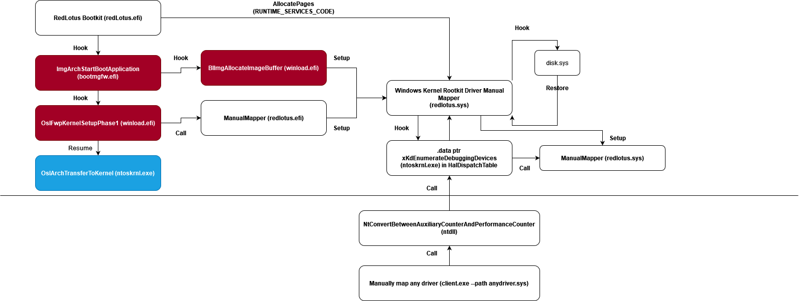
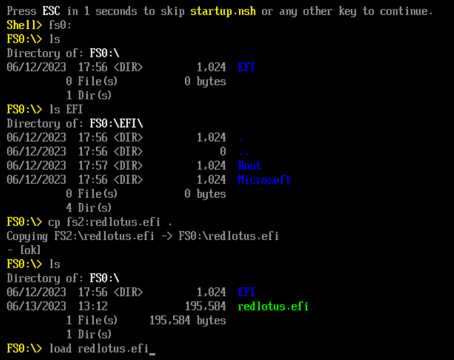
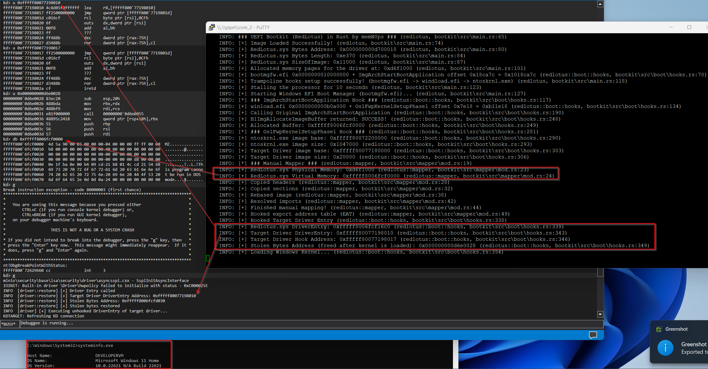
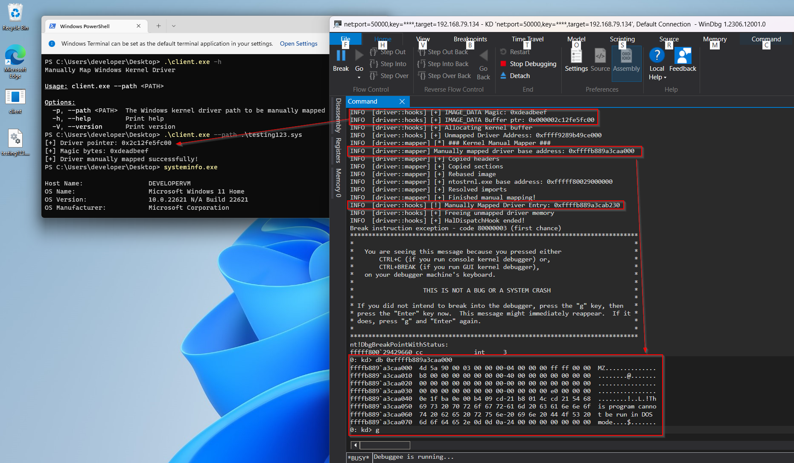

# Windows UEFI Bootkit in Rust (Codename: RedLotus)

Introducing a Windows UEFI Bootkit in Rust designed to facilitate the manual mapping of a driver manual mapper before the kernel (`ntoskrnl.exe`) is loaded, effectively bypassing `Driver Signature Enforcement (DSE)`. This bootkit utilizes a UEFI runtime driver (`EFI_RUNTIME_DRIVER`) inspired by the work of [umap by @btbd](https://github.com/btbd/umap/). By employing a straightforward `.data` function pointer hook, the driver manual mapper enables the manual mapping of various Windows kernel drivers via a user-mode program. It is important to acknowledge that the communication method involving `xKdEnumerateDebuggingDevices` and `NtConvertBetweenAuxiliaryCounterAndPerformanceCounter`, originally shared by the legendary [@can1357](https://blog.can.ac/), may be flagged by anti-cheat systems. Hence, it is crucial to emphasize that this project serves as a Proof of Concept (PoC).

It is possible to manually map my [Windows kernel rootkit](https://github.com/memN0ps/rootkit-rs) or [Windows blue-pill hypervisor](https://github.com/memN0ps/hypervisor-rs) with minor modifications.

This project is inspired by the following:

- Umap: https://github.com/btbd/umap/ (This project has been ported from C to Rust)
- Bootlicker: https://github.com/realoriginal/bootlicker
- BlackLotus: https://www.welivesecurity.com/2023/03/01/blacklotus-uefi-bootkit-myth-confirmed/
- ESPecter: https://www.welivesecurity.com/2021/10/05/uefi-threats-moving-esp-introducing-especter-bootkit/
- UEFI-Bootkit: https://github.com/ajkhoury/UEFI-Bootkit/
- EfiGuard: https://github.com/Mattiwatti/EfiGuard
- Bootkitting Windows Sandbox: https://secret.club/2022/08/29/bootkitting-windows-sandbox.html
- Rootkits and Bootkits: https://nostarch.com/rootkits

## Description

A bootkit can run code before the operating system and potentially inject malicious code into the kernel or load a malicious kernel driver by infecting the boot process and taking over the system's firmware or bootloader, effectively disabling or bypassing security protections. This tool can be used for game hacking and is a side project for those interested in fun, learning, malware research, and spreading security awareness. It also demonstrates that Rust can handle both low-level and high-level tasks. It's important to recognize the potential of Rust and not underestimate its power.

The image below shows how Legacy and UEFI boot works.


**Figure 1. Comparison of the Legacy Boot flow (left) and UEFI boot flow (right) on Windows (Vista and newer) systems (Full Credits: [WeLiveSecurity](https://www.welivesecurity.com/2021/10/05/uefi-threats-moving-esp-introducing-especter-bootkit/))**

This diagram illustrates the structure and flow of the `redlotus.efi` UEFI bootkit and `redlotus.sys` Windows kernel driver manual mapper.



## Install

### [Install Rust](https://www.rust-lang.org/tools/install)

To start using Rust, [download the installer](https://www.rust-lang.org/tools/install), then run the program and follow the onscreen instructions. You may need to install the [Visual Studio C++ Build tools](https://visualstudio.microsoft.com/visual-cpp-build-tools/) when prompted to do so.


### [Install and change to Rust nightly](https://rust-lang.github.io/rustup/concepts/channels.html)

```
rustup toolchain install nightly
rustup default nightly
```

### [Install cargo-make](https://github.com/sagiegurari/cargo-make)

```
cargo install cargo-make
```

### [Install WDK/SDK](https://docs.microsoft.com/en-us/windows-hardware/drivers/download-the-wdk)

* Step 1: Install Visual Studio 2022
* Step 2: Install Windows 11, version 22H2 SDK
* Step 3: Install Windows 11, version 22H2 WDK

## Build

Change directory to `.\driver\` and build driver

```
cargo make sign
```

Change directory to `.\bootkit\` and build bootkit

```
cargo build --target x86_64-unknown-uefi --release
```

Change directory to `.\client\` and build client

```
cargo build --release
```

## Debugging (Optional)

### 1. [Enabling Test Mode or Test Signing Mode](https://learn.microsoft.com/en-us/windows-hardware/drivers/install/the-testsigning-boot-configuration-option)

To enable `Test Mode` or `Test Signing Mode`, open an elevated command prompt and enter the following command:

```
bcdedit /set testsigning on
```

### 2. [Enabling Debugging of Windows Boot Manager (bootmgfw.efi), Windows OS Boot Loader (winload.efi), and Windows Kernel (ntoskrnl.exe)](https://learn.microsoft.com/en-us/windows-hardware/drivers/devtest/bcdedit--bootdebug)

The commands below enable debugging for the Windows Boot Manager, the boot loader, and the operating system's kernel. Using this combination allows for debugging at every startup stage. If activated, the target computer will break into the debugger three times: when the Windows Boot Manager loads, when the boot loader loads, and when the operating system starts. Enter the following commands in an elevated command prompt:

```
bcdedit /bootdebug {bootmgr} on
bcdedit /bootdebug on
bcdedit /debug on
```

### 3. [Setting Up Network Debugging for Windbg](https://learn.microsoft.com/en-us/windows-hardware/drivers/debugger/setting-up-a-network-debugging-connection)

To set up network debugging, open an elevated command prompt and enter the command below. Replace `w.x.y.z` with the IP address of the host computer and `n` with your chosen port number:

```
bcdedit /dbgsettings net hostip:w.x.y.z port:n
```

### 4. [Setting Up Debug Print Filter](https://learn.microsoft.com/en-us/windows-hardware/drivers/debugger/reading-and-filtering-debugging-messages#setting-the-component-filter-mask)

Open the Windows registry editor by entering the following command in an elevated command prompt:

```
regedit
```

For more focused and efficient kernel development troubleshooting, set up filters to selectively display debugging messages by following these steps:

1. Navigate to:

```
HKEY_LOCAL_MACHINE\SYSTEM\CurrentControlSet\Control\Session Manager
```
2. Create a new key named `Debug Print Filter`.
3. Inside this key, create a new `DWORD (32) Value`.
4. Name it `DEFAULT`.
5. Set its `Value data` to `8`.

## Usage

A UEFI Bootkit works under one or more of the following conditions:

- Secure Boot is disabled on the machine, so no vulnerabilities are required to exploit it (**supported by this project**).

- Exploiting a known flaw in the UEFI firmware to disable Secure Boot in the case of an out-of-date firmware version or a product no longer supported, including the Bring Your Own Vulnerable Binary (BYOVB) technique to bring copies of vulnerable binaries to the machines to exploit a vulnerability or vulnerabilities and bypass Secure Boot on up-to-date UEFI systems (1-day/one-day).

- Exploiting an unspecified flaw in the UEFI firmware to disable Secure Boot (0-day/zero-day vulnerability).

### Usage 1: Infecting the Windows Boot Manager (bootmgfw.efi) on Disk (Unsupported)

UEFI Bootkits typically target the Windows Boot Manager (`bootmgfw.efi`) found in the EFI partition at `\EFI\Microsoft\Boot\bootmgfw.efi` (also accessible at `C:\Windows\Boot\EFI\bootmgfw.efi`). The infection process involves adding a new section named `.efi` to the `bootmgfw.efi` and redirecting the executable's entry point to this new section. Here's a step-by-step breakdown:

1. Convert the bootkit into position-independent code (PIC) or shellcode.
2. Locate `bootmgfw.efi` (Windows Boot Manager) in the EFI partition at `\EFI\Microsoft\Boot\bootmgfw.efi`.
3. Append a new `.efi` section to the `bootmgfw.efi`.
4. Inject or copy the bootkit shellcode into the newly added `.efi` section.
5. Modify the entry point of `bootmgfw.efi` to point to the shellcode in the `.efi` section.
6. Reboot the system.

**Note**: This method is unsupported.

### Usage 2: Running a UEFI Bootkit through the UEFI Shell (Supported)

The following outlines a supported method to execute a UEFI Bootkit using the UEFI Shell. By leveraging either the EDK2 efi shell or the UEFI-Shell, users can set up a USB drive to boot into a UEFI shell environment. From there, the bootkit can be loaded and executed directly. The steps also include specific instructions for users working with VMware Workstation.

Download [EDK2 efi shell](https://github.com/tianocore/edk2/releases) or [UEFI-Shell](https://github.com/pbatard/UEFI-Shell/releases) and follow these steps:

1. Extract downloaded efi shell and rename file `Shell.efi` (should be in folder `UefiShell/X64`) to `bootx64.efi`

2. Format USB drive to FAT32

3. Create following folder structure:

```
USB:.
 │   redlotus.efi
 │
 └───EFI
      └───Boot
              bootx64.efi
```

4. Boot from the USB drive

    4.1. The following is required for VMware Workstation:

    * VMware Workstation: `VM -> Settings -> Hardware -> Add -> Hard Disk -> Next -> SCSI or NVMe (Recommended) -> Next -> Use a physical disk (for advanced users) -> Next -> Device: PhysicalDrive1 and Usage: Use entire disk -> Next -> Finish.` 

    * Start VM by clicking `Power On to Firmware`

    * Select Internal Shell (Unsupported option) or EFI Vmware Virtual SCSI Hard Drive (1.0)

5. A UEFI shell should start, change directory to the same location as the Windows Boot Manager (e.g. `FS0`). **Note that the file system could be different for your machine**

```
FS0:
```

6. Copy the bootkit to the same location as the Windows Boot Manager (e.g. `FS0`).

```
cp fs2:redlotus.efi fs0:
```

7. Load the the bootkit

```
load redlotus.efi
```

8. Windows should boot automatically.

9. Manually map your Windows kernel driver using the user-mode application (`client.exe`) even with `Driver Signature Enforcement (DSE)` enabled.

```
PS C:\Users\developer\Desktop> .\client.exe -h
Manually Map Windows Kernel Driver

Usage: client.exe --path <PATH>

Options:
  -p, --path <PATH>  The Windows kernel driver path to be manually mapped
  -h, --help         Print help
  -V, --version      Print version
```

## PoC

Tested on: 

* `Microsoft Windows 10 Home 10.0.19045 N/A Build 19045`
* `Microsoft Windows 11 Home 10.0.22621 N/A Build 22621`

This image demonstrates the loading of the bootkit (`redlotus.efi`) from a UEFI Shell.



This image depicts the successful manual mapping of the driver manual mapper (`redlotus.sys`).



This image showcases the successful manual mapping of a Windows kernel driver (`testing123.sys`), which could be written in any language such as C or Rust. It demonstrates the utilization of the user-mode application (`client.exe`) to communicate with the driver manual mapper (`redlotus.sys`).



Please note that depending on your Windows build and version, you may need to adjust the signatures of the hooked `bootmgfw.efi` and `winload.efi` functions, as well as the `.data` function pointer signature in `ntoskrnl.exe`. These changes are necessary to ensure compatibility and proper functioning with your specific Windows build and version.

## Credits / References / Thanks / Motivation

* BTBD: https://github.com/btbd/umap/

* Austin Hudson: https://github.com/realoriginal/bootlicker

* Thanks for all the help: inlineHookz (smoke/snow/never_unsealed): https://twitter.com/never_unsealed

* Rust Community Discord: https://discord.com/invite/rust-lang (#windows-dev channel PeterRabbit, MaulingMonkey etc..)

* Aidan Khoury: https://github.com/ajkhoury/UEFI-Bootkit/

* Matthijs Lavrijsen: https://github.com/Mattiwatti/EfiGuard

* Welivesecurity: https://www.welivesecurity.com/2021/10/05/uefi-threats-moving-esp-introducing-especter-bootkit/

* Welivesecurity: https://www.welivesecurity.com/2023/03/01/blacklotus-uefi-bootkit-myth-confirmed/

* MrExodia: https://secret.club/2022/08/29/bootkitting-windows-sandbox.html

* Samuel Tulach: https://github.com/SamuelTulach/rainbow

* UnknownCheats: https://www.unknowncheats.me/forum/anti-cheat-bypass/452202-rainbow-efi-bootkit-hwid-spoofer-smbios-disk-nic.html

* ekknod: https://github.com/ekknod/sumap/

* Cr4sh: https://github.com/Cr4sh/s6_pcie_microblaze/tree/master/python/payloads/DmaBackdoorBoot

* Alex Matrosov: Rootkits and Bootkits: https://nostarch.com/rootkits by [Alex Matrosov](https://twitter.com/matrosov)

* Binarly: https://www.binarly.io/posts/The_Untold_Story_of_the_BlackLotus_UEFI_Bootkit/index.html

* rust-osdev: https://github.com/rust-osdev/uefi-rs

* rust-osdev: https://github.com/rust-osdev/bootloader

* rust-osdev: https://crates.io/crates/uefi

* rust-osdev: https://docs.rs/uefi/latest/

* rust-osdev: https://rust-osdev.github.io/uefi-rs/HEAD/

* https://learn.microsoft.com/en-us/windows-hardware/manufacture/desktop/bcd-system-store-settings-for-uefi?view=windows-11

* https://developer.microsoft.com/en-us/windows/downloads/virtual-machines/

* https://github.com/LongSoft/UEFITool

* https://github.com/tianocore/edk2

* https://github.com/pbatard/UEFI-Shell

* https://securelist.com/cosmicstrand-uefi-firmware-rootkit/106973/

* https://wikileaks.org/ciav7p1/cms/page_36896783.html

* https://github.com/nix-community/lanzaboote/

* https://github.com/lyricalsoul/genie/

* https://github.com/pfnsec/uefi-bin-enum/

* https://github.com/coreos/picker

* https://github.com/mikroskeem/apple-set-os/

* https://github.com/Justfr33z/trampoline/

* https://github.com/kweatherman/sigmakerex

* https://guidedhacking.com/threads/external-internal-pattern-scanning-guide.14112/

* https://guidedhacking.com/resources/guided-hacking-x64-cheat-engine-sigmaker-plugin-ce-7-2.319/

* https://github.com/frk1/hazedumper-rs/

* https://github.com/Jakobzs/patternscanner/

* https://github.com/pseuxide/toy-arms/

* https://uefi.org/specs/UEFI/2.10/index.html

* https://github.com/x1tan/rust-uefi-runtime-driver/

* https://github.com/tandasat/MiniVisorPkg/blob/master/Docs/Building_and_Debugging.md

* https://xitan.me/posts/rust-uefi-runtime-driver/

* https://github.com/tandasat/MiniVisorPkg/blob/master/Docs/Testing_UEFI_on_Hyper-V.md

* https://www.intel.com/content/www/us/en/download/674520/intel-uefi-development-kit-intel-udk-debugger-tool-windows.html

* https://doxygen.reactos.org/

* https://www.vergiliusproject.com/

* thanks [jonaslyk](https://twitter.com/jonasLyk) for providing the correct function signature for `BlImgAllocateImageBuffer` :)

* idontcode aka @_xeroxz: https://blog.back.engineering/08/06/2020/

* can1357: https://www.unknowncheats.me/forum/2614582-post12.html

* https://www.unknowncheats.me/forum/anti-cheat-bypass/503521-data-ptr.html

* https://www.unknowncheats.me/forum/anti-cheat-bypass/425352-driver-communication-using-data-ptr-called-function.html

* https://git.back.engineering/gmh5225/ida-find-.data-ptr

* https://www.unknowncheats.me/forum/general-programming-and-reversing/582086-simple-ida-python-script-data-ptr.html

* https://www.unknowncheats.me/forum/programming-for-beginners/193545-trying-sig-offset-ida.html

* Thanks [not_matthias](https://github.com/not-matthias), [draven/rmccrystal](https://github.com/rmccrystal), @jessiep_ :)

* Thanks [Idov31](https://github.com/Idov31) for this link: https://learn.microsoft.com/en-us/windows-hardware/drivers/devtest/bcdedit--bootdebug
